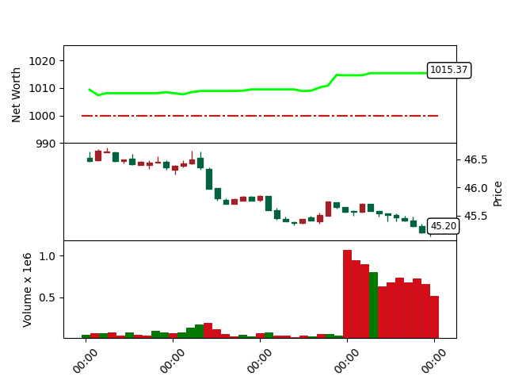

# gym-trading-env

## Installation

You can install the tool by running:
```shell
pip3 install -r requirements.txt
```

## Running

You run the tool with the command:
```shell
python3 main.py
```

## Expected output

The algorithm is going to run on historical data and the environment is rendered with the networth (initially set to 1,000), the price candles and the market volume.

